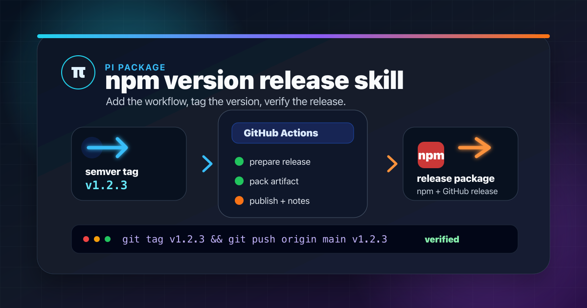

# pi-version-release-skill

<p align="center">
  
</p>

Pi package for release/version automation skills.

## Skills

- `github-release-workflow` — add a templated GitHub Actions release workflow to a Node/npm or pi package repository.
- `release-new-version` — release a new semver version by checking the release workflow, choosing the next tag, pushing it, and verifying GitHub Actions.

## Install

From npm:

```bash
pi install npm:@micka33/pi-version-release-skill
```

From this repository:

```bash
pi install git:git@github.com:Micka33/pi-version-release-skill.git@latest
```

## Add a release workflow

The skill uses `scripts/add-release-workflow.mjs` to copy `templates/release.yml` into a target repository at `.github/workflows/release.yml`.

```bash
node scripts/add-release-workflow.mjs \
  --repo /path/to/repository \
  --github-package-scope @micka33
```

With pnpm and CI before packing/publishing:

```bash
node scripts/add-release-workflow.mjs \
  --repo /path/to/repository \
  --github-package-scope @micka33 \
  --package-manager pnpm \
  --run-ci
```

Useful options:

```text
--package-manager npm|pnpm
--run-ci
--ci-command "npm run ci"
--install-command "npm ci"
--pnpm-version 10
--force
```

The generated workflow expects a `package.json`, a `.node-version` file, semver tags like `v1.2.3`, and a GitHub secret named `NPM_ACCESS_TOKEN`.

## Package contents

```text
assets/
├── social-preview.png
└── social-preview.svg
scripts/
└── add-release-workflow.mjs
templates/
└── release.yml
skills/
├── github-release-workflow/
│   └── SKILL.md
└── release-new-version/
    └── SKILL.md
```
